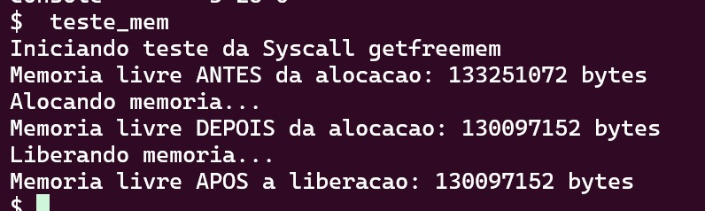
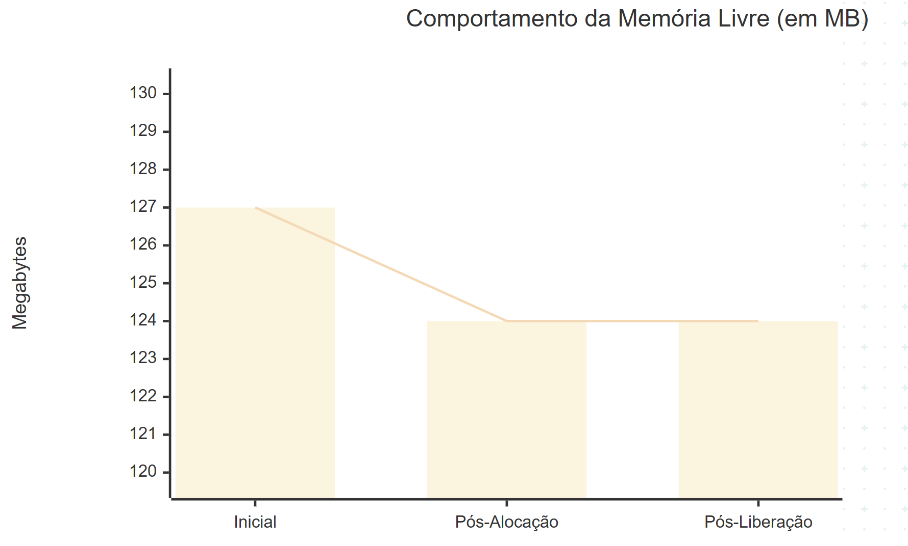
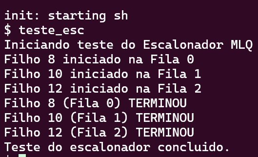
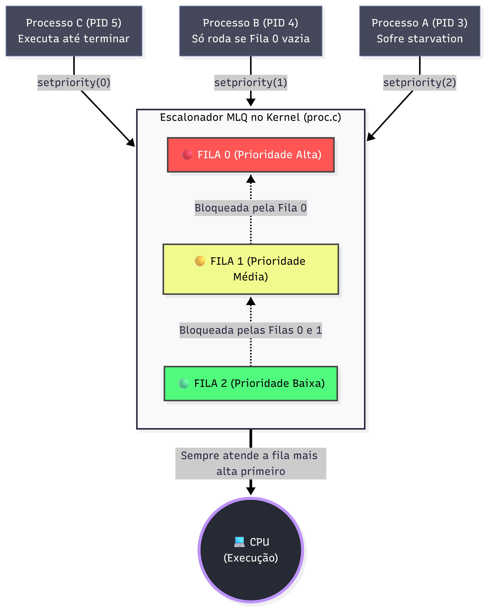

**Universidade Federal de Uberlândia (UFU)**  
**Disciplina:** Sistemas Operacionais  
**Alunos:**  Anna Julia, Jailce Fernanda Brito, Vitor Martins, Eugenio Marins


# Relatório Técnico: Implementação de Gerenciamento de Memória e Escalonador MLQ no xv6
# **Grupo:** 7 | **Tema:** getfreemem() 


### Repositório: https://github.com/jailce/xv6-getfreemem-project


---

## 1. Introdução
Este relatório mostra o que a nossa equipe fez para alterar o funcionamento do xv6, focando em duas partes: gerenciar a memória e mudar como os processos são escolhidos para rodar (escalonamento). 

O xv6 original é bem simples. Ele não avisa pro usuário quanta memória tem sobrando e usa a política de Round Robin (onde todo mundo ganha uma quantidade de tempo igual na CPU). O nosso objetivo foi adicionar uma função `getfreemem` para a gente conseguir ver a memória livre, e criar um escalonador de Múltiplas Filas (MLQ) com prioridades, junto com a chamada `setpriority`.

---

## 2. Gerenciamento de Memória: Chamada `getfreemem`
Para a gente conseguir inspecionar quanta memória física está sobrando no sistema, desenvolvemos a chamada `getfreemem`. 

### Como foi feito no Kernel (`kernel/kalloc.c`)
No xv6, a memória livre fica guardada numa lista encadeada chamada `freelist`. A lógica que implementamos basicamente percorre essa lista a partir do começo e conta quantas páginas de 4096 bytes estão disponíveis.

### Mapeamento da Syscall
Para a função existir de verdade e o usuário poder chamar, seguimos o padrão de interrupção do xv6 adicionando as assinaturas nestes arquivos:
* **`kernel/syscall.h`**: Definimos o número da syscall.
* **`kernel/syscall.c`**: Mapeamos a função no vetor do kernel.
* **`user/user.h` e `user/usys.pl`**: Colocamos a assinatura `int getfreemem(void);` para o código de usuário conseguir enxergar a função.


### O Teste da Syscall getfreemem()

Para testar, incluímos um programa chamado `teste_mem.c` no Makefile. Ele chama a função, aloca um pouco de memória e chama de novo para ver se o número de páginas diminuiu corretamente.
A ideia era ver os números do sistema mudando na prática. O código utilizado foi este:

```c


int
main(int argc, char *argv[])
{
	// Teste da Syscall getfreemem
	uint64 antes, depois, apos_liberacao;
	printf("Iniciando teste da Syscall getfreemem\n");

	antes = getfreemem();
	// Força a alocação de memória para testar a liberação
	printf("Memoria livre ANTES da alocacao: %lu bytes\n", antes);
	printf("Alocando memoria...\n");
	char *mem1 = malloc(1024 * 1024);
	char *mem2 = malloc(2 * 1024 * 1024);

	depois = getfreemem();
	// Teste da liberacao de memoria
	printf("Memoria livre DEPOIS da alocacao: %lu bytes\n", depois);
	printf("Liberando memoria...\n");
	free(mem1);
	free(mem2);
	// Verifica a quantidade de memória livre após a liberação
	apos_liberacao = getfreemem();
    printf("Memoria livre APOS a liberacao: %lu bytes\n", apos_liberacao);
	
	exit(0);
}

```




 O resultado esperado era que, após o free(), o valor voltasse para os 133251072 bytes iniciais, acreditamos que isso ocorre por que o free() não devolve a memoria fisica para o kernel imediatamente, mas só marca virtalmente como livre para ser usado. Contudo, o teste atendeu a demanda de testar a syscall getfreemem(), e seguir com a estratégia do escalonador.

### Tabela e Gráfico Teste de Alocação (`teste_mem`)

Para facilitar a visualização do comportamento da memória gerenciada pelo kernel durante o teste, os dados coletados na execução foram tabulados abaixo.

| Fase da Execução | Ação Realizada no Código | Memória Livre (Bytes) | Memória Livre (MB) |
| :--- | :--- | :--- | :--- |
| **1. Estado Inicial** | Primeira chamada de `getfreemem()` | 133.251.072 | ~ 127 MB |
| **2. Pós-Alocação** | `malloc(1MB)` + `malloc(2MB)` | 130.105.344 | ~ 124 MB |
| **3. Pós-Liberação** | `free()` dos blocos alocados | 130.105.344* | ~ 124 MB* |




---

## 3. Escalonador de Múltiplas Filas (MLQ)
A mudança mais importante foi tirar o Round Robin padrão e colocar um sistema com 3 filas de prioridade (0, 1 e 2). A fila 0 é a mais alta e a 2 é a mais baixa.


### Estrutura do Processo (`kernel/proc.h` e `kernel/proc.c`)
Primeiro, tivemos que ensinar o processo a ter uma prioridade. Adicionamos o campo `priority` na estrutura dele:

```c
// Per-process state
struct proc {
  struct spinlock lock;

  enum procstate state;        // Estado do processo (UNUSED, SLEEPING, RUNNABLE, etc)
  void *chan;                  // Canal de suspensão
  int killed;                  // Sinalizador de encerramento
  int xstate;                  // Status de saída retornado ao pai
  int pid;                     // Identificador do Processo (PID)
  int priority;                // Nível de prioridade para o MLQ (0 = Alta, 1 = Média, 2 = Baixa)
  
  // ... demais campos originais
};
```

Depois, no `kernel/proc.c` (dentro do `allocproc`), garantimos que todo processo novo vai nascer com a prioridade 1 (média):
```c
  p->pid = allocpid();
  p->priority = 1;  // Todo processo nasce na prioridade média/padrão
```

### Mudando a função do Escalonador
No xv6 normal, a função `scheduler(void)` verifica a lista de processos inteira e roda quem estiver pronto. Nós mudamos isso colocando um loop externo. 

Agora, o kernel varre a tabela procurando só processos da fila 0. Se achar, ele roda e o loop volta pro começo. Ele só vai olhar as filas 1 e 2 se não tiver ninguém na fila de cima.

```c
void
scheduler(void)
{
  struct proc *p;
  struct cpu *c = mycpu();

  c->proc = 0;
  for (;;) {
    intr_on();
    intr_off();

    int found = 0;

    // Tentativa de criar o MLQ: vamos varrer da fila 0 (maior) ate a fila 2 (menor)
    for (int target_priority = 0; target_priority <= 2; target_priority++) {
      for (p = proc; p < &proc[NPROC]; p++) {
        acquire(&p->lock);
        
        // Verifica se o processo quer rodar e se pertence a fila que estamos olhando agora
        if (p->state == RUNNABLE && p->priority == target_priority) {
          p->state = RUNNING;
          c->proc = p;
          swtch(&c->context, &p->context);

          c->proc = 0;
          found = 1; // Achamos um processo para rodar nessa fila
        }
        release(&p->lock);
      }
      
      // Se rodou alguem na fila alta, quebra para voltar a checar do topo (fila 0)
      if (found) {
        break;
      }
    }

    if (found == 0) {
      asm volatile("wfi");
    }
  }
}
```

---

## 4. Chamada `setpriority`
Para a gente poder trocar a fila de um processo enquanto ele está rodando, criamos a chamada `setpriority(int)`.

### Lógica no Kernel (`kernel/sysproc.c`)
A função resgata o valor digitado pelo usuário, checa se a fila realmente existe (0, 1 ou 2) para não quebrar o sistema, e então muda o valor dentro da estrutura do processo atual. O mapeamento dessa função seguiu os mesmos passos da `getfreemem`.

```c
uint64
sys_setpriority(void)
{
  int priority;

  // Pegando o primeiro argumento inteiro passado pelo usuario
  argint(0, &priority);

  // Validacao basica para evitar que o usuario configure uma fila que nao existe
  if(priority < 0 || priority > 2)
    return -1;

  // Modifica a prioridade do processo atual que chamou a syscall
  struct proc *p = myproc();
  acquire(&p->lock);
  p->priority = priority;
  release(&p->lock);

  return 0;
}
```

---

## 5. Resultados e Comparação
Para testar se tudo isso funcionou na prática, criamos o programa `user/teste_esc.c`. O código cria 3 processos filhos. Cada filho usa o `setpriority` para se jogar numa fila diferente (Fila 0, Fila 1 e Fila 2) e depois entra num loop fazendo milhares de somas com números inteiros para gastar a CPU de propósito.

Rodamos o simulador forçando o uso de apenas uma CPU (`make qemu CPUS=1`) para os resultados ficarem claros. A saída do terminal foi essa:

 


###  Teste do Escalonador (`teste_esc`)

Para provar o funcionamento da prioridade estrita, forçamos a criação de três processos filhos simultâneos realizando cálculos matemáticos, atribuindo-os a filas diferentes usando a nossa syscall `setpriority()`.

| Processo (PID Fictício) | Fila Atribuída | Ordem de Criação (Chegada) | Ordem de Conclusão (Término) | Comportamento Observado |
| :--- | :--- | :--- | :--- | :--- |
| **Filho C** | Fila 0 (Alta) | 3º a ser criado | **1º a terminar** | Furou a fila. Monopolizou a CPU imediatamente após sua criação. |
| **Filho B** | Fila 1 (Média) | 2º a ser criado | **2º a terminar** | Aguardou o Filho C morrer. Executou e bloqueou a fila inferior. |
| **Filho A** | Fila 2 (Baixa) | 1º a ser criado | **3º a terminar** | Sofreu *starvation* temporário. Só rodou quando o sistema ficou ocioso. |


### Analisando o resultado

No xv6 original (Round Robin), esses três filhos iam terminar quase juntos e os "TERMINOU" iam aparecer misturados na tela, porque o kernel ficaria dividindo o tempo entre eles o tempo todo. 




No nosso MLQ, o resultado foi o seguinte: o Filho 8 monopolizou a CPU porque estava na Fila 0. Ninguém mais rodou até ele acabar a conta dele. Só depois que ele morreu, o Filho 10 (Fila 1) teve chance de rodar. O Filho 12, coitado, ficou na Fila 2 esperando todo mundo terminar para só então conseguir processar. Isso provou na prática que o nosso algoritmo respeitou as prioridades.

---

## 6. Conclusão
Conseguimos entregar o que foi pedido no projeto. A função `getfreemem` mostrou que é possível acessar informações de memória de dentro do kernel. A troca do escalonador alterou de vez o comportamento do xv6, mostrando que agora o sistema respeita filas de prioridade e foca nos processos mais importantes, exatamente como vimos nos prints do terminal. Todo o código rodou sem erros ou problemas de estouro de instrução após os últimos ajustes.


## Referências Bibliográficas
**SILBERSCHATZ, A.; GALVIN, P. B.; GAGNE, G.** *Sistemas Operacionais com Java*. 9ª Edição. Rio de Janeiro: Elsevier, 2015. (Utilizado como base teórica para a modelagem do escalonador de múltiplas filas - MLQ e conceitos de *starvation*).

**TANENBAUM, A. S.; BOS, H.** *Sistemas Operacionais Modernos*. 4ª Edição. São Paulo: Pearson Education do Brasil, 2016. (Referência para os conceitos fundamentais de gerenciamento de memória física, *heap* e alocação de páginas do sistema).


